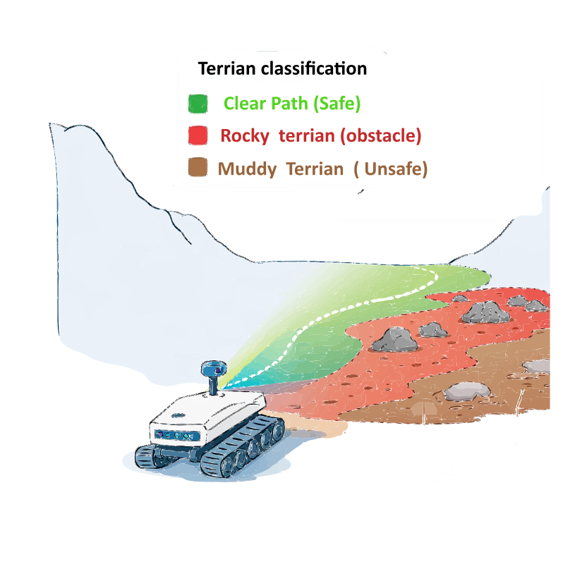
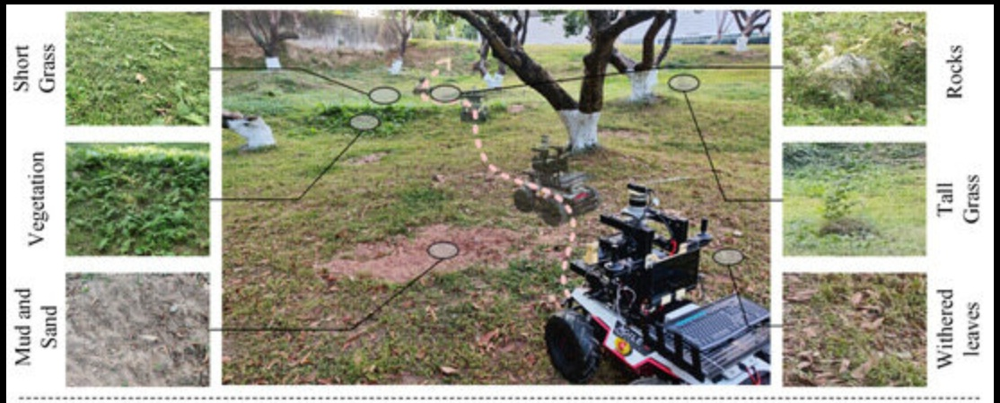
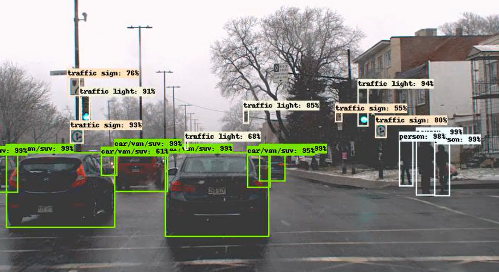
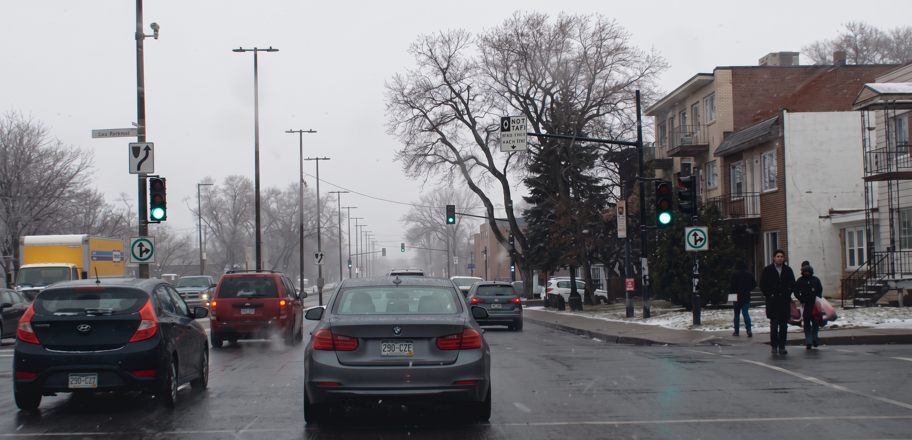
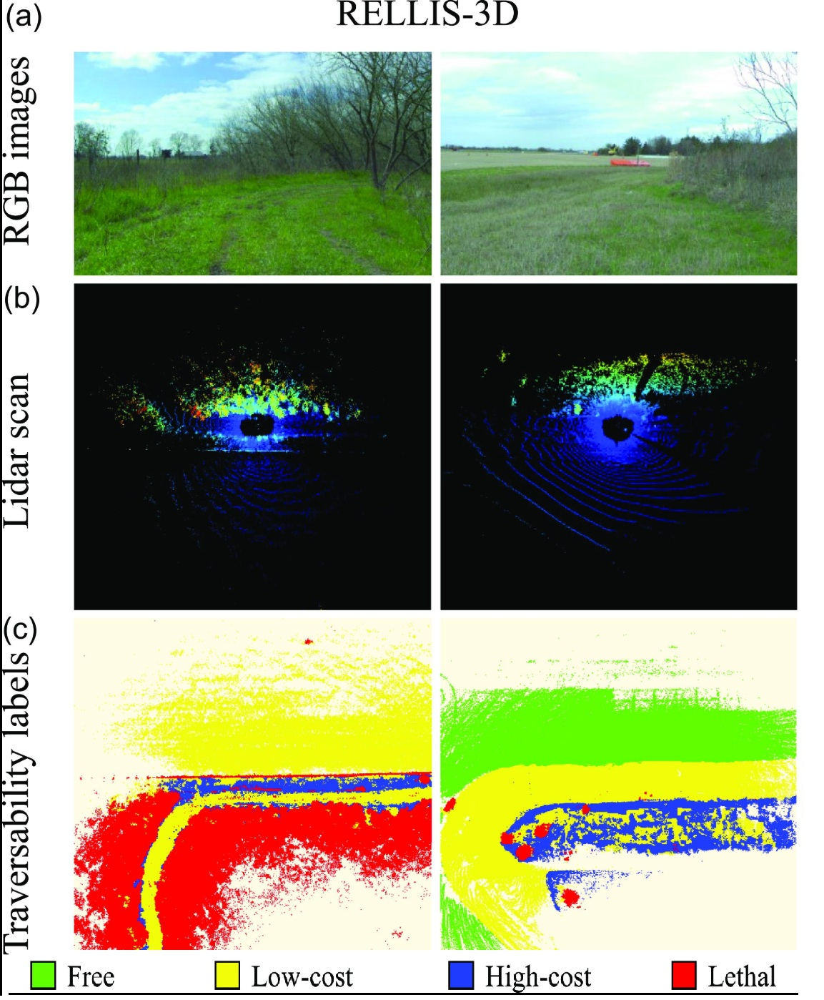
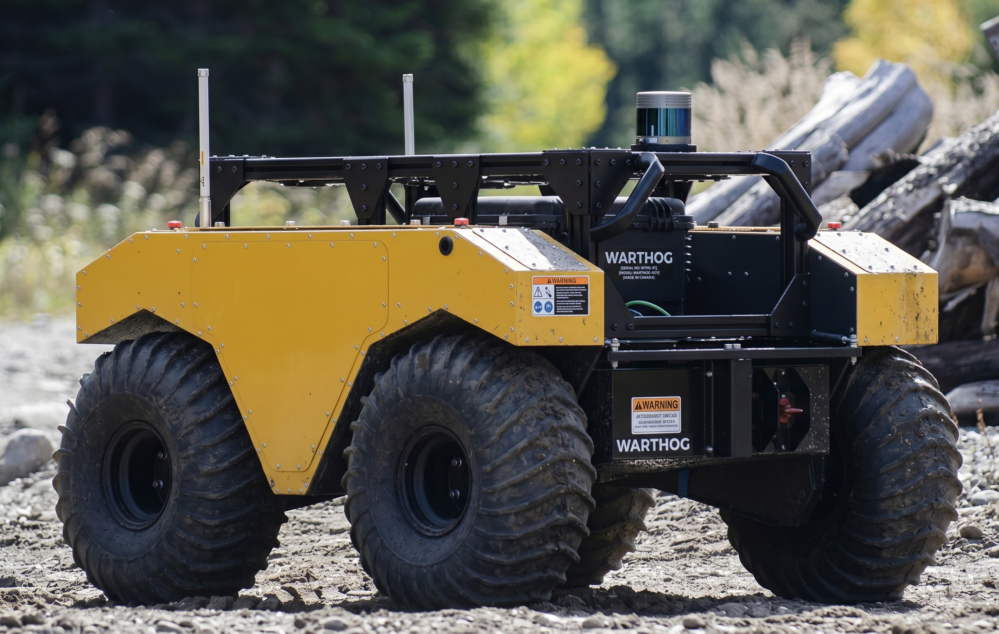
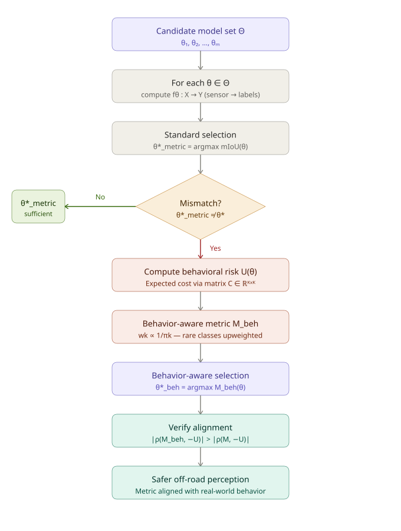
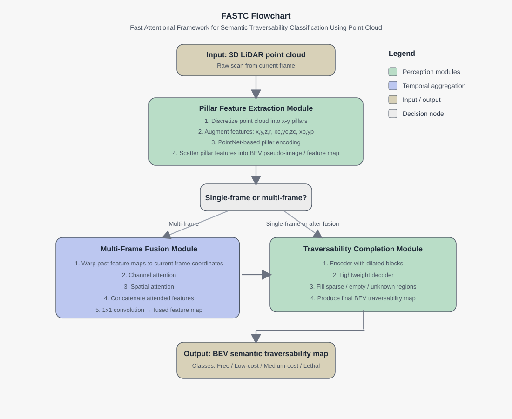
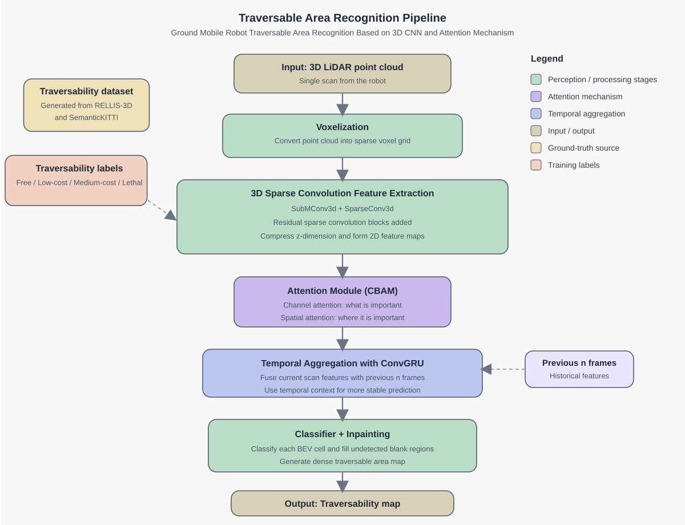
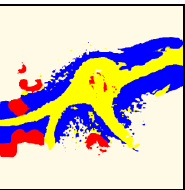

---
format:
  clean-revealjs:
    embed-resources: true
    slide-number: true
    controls: true
    center: false
    width: 1400
    height: 800
    min-scale: 0.5
    max-scale: 1.5
    margin: 0.1
    scrollable: false
    transition: slide
    transition-speed: default
    navigation-mode: linear
    progress: true
    footer: "KFUPM · 2026"
---

<!-- START: Title Slide -->
```{=html}
<style>
.reveal .slides section {
  box-sizing: border-box;
  width: 100%;
  height: 100%;
  padding: 22px 28px;
  overflow: hidden;
}


.frontpage-layout {
  display: flex;
  flex-direction: column;
  gap: 10px;
  align-items: center;
  justify-content: flex-start;
  padding-top: 20px;
  height: 100%;
}

.frontpage-title {
  font-size: 1.05em;
  line-height: 1.2;
  color: #1f3f64;
  width: 100%;
  max-width: 1200px;
  text-align: center;
}

.frontpage-art {
  display: flex;
  justify-content: center;
  align-items: center;
  width: 100%;
  max-height: 380px;
}

.frontpage-art img {
  width: 100%;
  max-width: none;
  max-height: 380px;
  object-fit: contain;
}

.reveal.slide .slides .stack.present > section.future {
  -webkit-transform: translate(100%, 0);
  transform: translate(100%, 0);
}
.reveal.slide .slides .stack.present > section.past {
  -webkit-transform: translate(-100%, 0);
  transform: translate(-100%, 0);
}
</style>  

<div class="frontpage-layout">
  <div class="frontpage-title">
    Traversable terrain maps in unstructured environments for autonomous vehicles
  </div>

  <div style="margin-top: 18px; font-size: 1.1em; color: #444;">
    <strong>Proposal Defence</strong>
  </div>

  <div style="margin-top: 14px; font-size: 0.85em; color: #555; line-height: 1.8;">
    <div><strong>Student:</strong> Mahmoud Abdelaal (Master’s Student)</div>
    <div><strong>Supervisor:</strong> Dr. Brahim Brahimi</div>
    <div>
      <strong>Committee Members:</strong>
      Dr. Brahim Brahimi, Dr. Mohammad A. Abido &amp; Dr. Mahmoud Khater
    </div>
    <div><strong>Department of Electrical Engineering</strong></div>
  </div>

  <div class="frontpage-art">
    
  </div>
</div>
```
<!-- END: Title Slide -->


<!-- START: Unstructured Environment -->
## Unstructured Environment 


<figure style="text-align:center;">
  
  <figcaption>Unstructured environment. Zhang, Bo, et al. "Autonomous vehicles traversability mapping fusing semantic–geometric in off-road navigation." Drones 8.9 (2024): 496.</figcaption>
</figure>
<!-- END: Unstructured Environment -->

<!-- START: Structured Environment -->
## Structured Environment

<div style="display:flex; gap:24px; justify-content:center; align-items:flex-start;">
  <figure style="text-align:center; flex:1; margin:0;">
    
    <figcaption>Algolux. (2019, March 11). Algolux announces Ion, a development platform for autonomous vision systems.</figcaption>
  </figure>
  <figure style="text-align:center; flex:1; margin:0;">
     
    <figcaption>Structured urban environment — well-defined lanes, traffic signals, and predictable geometry.</figcaption>
  </figure>
</div>
<!-- END: Structured Environment -->

<!-- START: Traversability -->
## Traversability

What is traversability?
Traversability is the local terrain report (can I cross this mud?)
<figure style="text-align:center;">
  
  <figcaption>Wu, Siyao, et al. <em>A real-time LiDAR-based terrain traversability classification approach in off-road environments.</em> Robotica 43.10 (2025): 3519-3532.</figcaption>
</figure>
<!-- END: Traversability -->


# <span style="color:#1f3f64; font-weight:800; font-size:0.72em;">Difference between Path Planning and Traversability</span> {background-color="#ffffff"}

<p style="color:#64748b; font-size:0.5em; margin-top:0.6em;">

</p>

<div style="width:120px; height:5px; background:#2563eb; border-radius:999px; margin-top:1.1em;"></div>
<!-- START: Path Planning -->
## Path Planning

```{=html}
<style>
.path-planning-frame {
  width: 100%;
  height: 560px;
  border: 0;
  border-radius: 18px;
  background: #ffffff;
  box-shadow: 0 8px 24px rgba(15, 23, 42, 0.08);
}

.path-planning-note {
  margin-top: 12px;
  font-size: 0.86em;
  color: #475569;
}
</style>

<iframe
  class="path-planning-frame"
  src="path_planning.html"
  scrolling="no"
  title="Interactive path planning slide">
</iframe>

<div class="path-planning-note">
  Interactive slide showing the obstacle layout and feasible path from start to goal.
</div>
```
<!-- END: Path Planning -->

<!-- START: Traversability Interactive -->
## Traversability Interactive

```{=html}
<style>
.traversability-frame {
  width: 100%;
  height: 560px;
  border: 0;
  border-radius: 18px;
  background: #ffffff;
  box-shadow: 0 8px 24px rgba(15, 23, 42, 0.08);
}

.traversability-note {
  margin-top: 12px;
  font-size: 0.86em;
  color: #475569;
}
</style>

<iframe
  class="traversability-frame"
  src="traversibilty_interactive.html"
  scrolling="no"
  title="Interactive traversability cost-map slide">
</iframe>

<div class="traversability-note">
  Interactive slide for exploring traversability classes, numeric costs, and preferred path choices.
</div>
```
<!-- END: Traversability Interactive -->


# <span style="color:#1f3f64; font-weight:800; font-size:0.72em;">Problem and gap</span> {background-color="#ffffff"}

<p style="color:#64748b; font-size:0.5em; margin-top:0.6em;">

</p>

<div style="width:120px; height:5px; background:#2563eb; border-radius:999px; margin-top:1.1em;"></div>


<!-- START: Problem Statement -->
<!-- SLIDE 2: Why this problem matters -->
## Problem Statement{style="font-size: 0.9em"}
Given sensor data, determine whether the terrain is traversable and, if so, estimate the least-cost path through it

We are trying to answer:
Is this terrain traversable or not? If it is, what is the least-cost area?

How do we answer this question?
A general approach is to learn traversability from data, using supervised or self-supervised learning, and then build a cost map for planning. In this proposal, we follow the supervised approach and generate a cost map.

### Off-road autonomy is fundamentally safety-critical
- Off-road environments are [unstructured, imbalanced, and operationally harsh]{.underline}.
- Rare terrain classes such as [mud, puddles, water, holes, and rocks]{.underline} may dominate failure risk.
- Standard perception metrics can hide dangerous behavior on these rare classes.
- Therefore, a model with higher mIoU is not necessarily the safer model.

**Core motivation:** Know whether an area is traversable and where the safest passage is.


::: notes
Keep this slide practical.
Emphasize that dominant classes such as grass or sky can inflate performance while hazardous classes remain poorly handled.
:::
<!-- END: Problem Statement -->


<!-- START: Research Gap -->
<!-- SLIDE 4: Research gap -->
## Research gap

### Gap between perception metrics and real behavior

Current practice usually assumes:

$$
\text{Higher mIoU} \Rightarrow \text{better deployment behavior}
$$

But this assumption can fail because of:

- class imbalance,
- asymmetric misclassification costs, and
- safety-critical false-safe errors.

### Main gap

Different attention mechanisms, activation functions, and optimization methods have not been systematically tested with FASTC or RAC-BEVNet.

::: notes
This is the slide that should resonate most with Dr. Abido.
Frame the issue as an objective-function mismatch.
:::
<!-- END: Research Gap -->

<!-- START: Why -->
<!-- SLIDE 8: Why this should be interesting -->
## Aim of this work


This work can be interpreted as:

- a design-space exploration problem for FASTC, where performance is studied under different attention mechanisms, activation functions, and optimization strategies
- an input-resolution sensitivity problem for RAC-BEVNet, where the effect of image size on model accuracy and robustness is evaluated
- a comparative algorithm-refinement problem, with the objective of improving traversability-classification performance relative to baseline models
- an optimization-driven perception problem, where model choices are assessed using standard evaluation metrics such as mIoU


<!-- START: Objectives of Proposal -->
## **Objectives of Proposal**

1. Implement a behavior-aware evaluation framework for off-road terrain perception in order to assess model performance beyond standard metrics such as IoU and mIoU, with particular emphasis on safety-relevant errors and downstream hazard interpretation.

2. Investigate and modify a FASTC-style LiDAR traversability architecture, with a focus on improving its attention mechanism and related components, in order to achieve stronger terrain classification performance than the published baseline.

3. Investigate and modify a BEVNet-style LiDAR traversability architecture based on 3D sparse convolution, residual modules, and attention mechanisms, in order to achieve better traversable area recognition performance than the published method.
<!-- END: Objectives of Proposal -->


::: notes
<!--
- a **cost-function design problem**,
- a **risk-sensitive model-selection problem**,
- a **algorithmic refinement task to elevate baseline perception metrics (mIoU)**
-->
:::
<!-- END: Why -->


<!-- START: System-level View -->
<!-- SLIDE 6: System-level view 
## System-level view

### Proposed pipeline

1. **Sensor input** (LiDAR, and potentially multimodal extensions later)
2. **Terrain classification / traversability estimation**
3. **Cost-aware hazard interpretation**
4. **Near-field hazard aggregation**
5. **Safest heading recommendation**

### Scope of the work

- Main focus: **environmental perception**
- Output is linked to downstream behavior
- Full global planning is **not** the main scope

::: notes
Present this as a modular engineering system.
That framing aligns well with control and decision-support thinking.
:::
 END: System-level View -->


 

# <span style="color:#1f3f64; font-weight:800; font-size:0.72em;">Literature review</span> {background-color="#ffffff"}

<p style="color:#64748b; font-size:0.5em; margin-top:0.6em;">

</p>

<div style="width:120px; height:5px; background:#2563eb; border-radius:999px; margin-top:1.1em;"></div>


## Literature Gap: From Semantic Segmentation to Risk-Aware BEV Traversability
```{=html}
<style>
.snake-wrap {
  font-size: 14px;
  max-width: 1280px;
  margin: 0 auto;
  padding: 20px 50px 0;
  display: flex;
  gap: 20px;
  align-items: flex-start;
}
.snake-tl {
  flex: 1;
  min-width: 0;
  padding-top: 8px;
}
.snake-item {
  position: relative;
  padding: 7px 16px 12px;
  min-height: 52px;
  box-sizing: border-box;
  cursor: pointer;
  transition: opacity 0.15s;
}
.snake-item:hover { opacity: 0.75; }
.snake-item.snake-active { opacity: 1; }
.snake-item.s-right {
  border-right: 2px solid #1a1a1a;
  border-bottom: 2px solid #1a1a1a;
  border-bottom-right-radius: 32px;
  margin-left: 30px;
  padding-right: 48px;
}
.snake-item.s-left {
  border-left: 2px solid #1a1a1a;
  border-bottom: 2px solid #1a1a1a;
  border-bottom-left-radius: 32px;
  margin-right: 30px;
  padding-left: 48px;
}
.snake-item:last-child {
  border-bottom: none;
  border-bottom-right-radius: 0;
  border-bottom-left-radius: 0;
}
.snake-item.s-right::before {
  content: '';
  position: absolute;
  top: -1px; right: -7px;
  width: 12px; height: 12px;
  border-radius: 50%;
  background: white;
  border: 2px solid #1a1a1a;
  transition: background 0.15s;
}
.snake-item.s-left::before {
  content: '';
  position: absolute;
  top: -1px; left: -7px;
  width: 12px; height: 12px;
  border-radius: 50%;
  background: white;
  border: 2px solid #1a1a1a;
  transition: background 0.15s;
}
.snake-item.snake-active.s-right::before,
.snake-item.snake-active.s-left::before {
  background: #2f67b7;
  border-color: #2f67b7;
}
.snake-year {
  position: absolute;
  font-size: 12px;
  font-weight: 700;
  color: #1a1a1a;
  line-height: 1;
}
.s-right .snake-year { top: -18px; right: 0; }
.s-left  .snake-year { top: -18px; left: 0; }
.snake-title {
  font-size: 12px;
  font-weight: 700;
  color: #1e3a5f;
}
.snake-body {
  font-size: 10px;
  color: #475569;
  margin-top: 3px;
  line-height: 1.35;
}
/* detail panel */
.snake-panel {
  width: 320px;
  flex-shrink: 0;
  background: #fff;
  border: 1px solid #d9dee7;
  border-radius: 16px;
  box-shadow: 0 4px 16px rgba(0,0,0,.08);
  padding: 16px 18px;
  box-sizing: border-box;
  min-height: 200px;
  font-size: 14px;
}
.snake-panel-year {
  display: inline-block;
  background: #eef2ff;
  color: #3730a3;
  font-size: 11px;
  font-weight: 700;
  border-radius: 999px;
  padding: 3px 10px;
  margin-bottom: 10px;
}
.snake-panel-title {
  font-size: 14px;
  font-weight: 700;
  color: #1e3a5f;
  margin-bottom: 10px;
  line-height: 1.4;
}
.snake-panel-section {
  font-size: 12px;
  color: #374151;
  line-height: 1.6;
  margin-bottom: 8px;
}
.snake-panel-section strong {
  color: #1e3a5f;
}
</style>

<div class="snake-wrap">
  <div class="snake-tl" id="snakeTl">

    <div class="snake-item s-right snake-active"
      data-year="2015"
      data-title="Long, Shelhamer, Darrell — FCN"
      data-summary="Fully Convolutional Networks for Semantic Segmentation introduced end-to-end pixelwise prediction by replacing fully-connected layers with convolutional ones, enabling dense labelling at arbitrary resolution."
      data-contribution="Introduced end-to-end dense pixelwise prediction using fully convolutional networks."
      data-gap="Works mainly as an image-space segmentation method; it does not address BEV traversability, temporal mapping, or risk-sensitive terrain cost.">
      <span class="snake-year">2015</span>
      <div class="snake-title">Long, Shelhamer, Darrell — FCN</div>
      <div class="snake-body">Fully Convolutional Networks — core backbone for pixelwise semantic segmentation.</div>
    </div>

    <div class="snake-item s-left"
      data-year="2015"
      data-title="Noh, Hong, Han — DeconvNet"
      data-summary="Learning Deconvolution Network for Semantic Segmentation proposed a symmetric encoder-decoder architecture using unpooling and deconvolution layers to produce fine-grained pixel-level labels."
      data-contribution="Introduced an encoder-decoder structure with unpooling and deconvolution for fine-grained segmentation."
      data-gap="Improves spatial detail, but remains a general image segmentation architecture without off-road BEV reasoning.">
      <span class="snake-year">2015</span>
      <div class="snake-title">Noh, Hong, Han — DeconvNet</div>
      <div class="snake-body">Encoder-decoder with deconvolution — key architecture reference alongside FCN.</div>
    </div>

    <div class="snake-item s-right"
      data-year="2015"
      data-title="Badrinarayanan, Handa, Cipolla — SegNet"
      data-summary="SegNet introduced a deep encoder-decoder architecture for semantic pixel-wise labelling, using pooling indices from the encoder to perform upsampling in the decoder without learning extra parameters."
      data-contribution="Used pooling indices for efficient decoder upsampling in semantic segmentation."
      data-gap="Efficient for segmentation, but not designed for sparse sensor fusion, BEV mapping, or terrain-risk classification.">
      <span class="snake-year">2015</span>
      <div class="snake-title">Badrinarayanan et al. — SegNet</div>
      <div class="snake-body">Encoder-decoder segmentation with pooling indices — frames the model design space.</div>
    </div>

    <div class="snake-item s-left"
      data-year="2016"
      data-title="Valada, Olivera, Brox, Burgard"
      data-summary="Deep Multispectral Semantic Scene Understanding of Forested Environments using multimodal RGB-D fusion for dense segmentation of off-road forested scenes, introducing the DeepScene dataset as a benchmark."
      data-contribution="Brought dense semantic segmentation to off-road forested environments using multimodal RGB-D perception."
      data-gap="Focuses on scene understanding, but does not directly produce BEV traversability cost maps for navigation.">
      <span class="snake-year">2016</span>
      <div class="snake-title">Valada et al. — DeepScene</div>
      <div class="snake-body">Multispectral off-road scene understanding — main comparison baseline and benchmark dataset.</div>
    </div>

    <div class="snake-item s-right"
      data-year="2017"
      data-title="Maturana et al."
      data-summary="Proposed a real-time semantic mapping system for autonomous off-road navigation by fusing image-based semantic segmentation with LiDAR-derived geometry into a 2.5D map used for path planning."
      data-contribution="Fused image-based semantic segmentation with LiDAR geometry to build a 2.5D traversability map."
      data-gap="Uses a mapping pipeline rather than an end-to-end BEV traversability network with learned dense completion.">
      <span class="snake-year">2017</span>
      <div class="snake-title">Maturana et al.</div>
      <div class="snake-body">Early off-road semantic mapping — fused image segmentation with LiDAR into a 2.5D traversability map.</div>
    </div>

    <div class="snake-item s-left"
      data-year="2017"
      data-title="Xiang &amp; Fox"
      data-summary="Introduced temporal recurrence into the semantic mapping pipeline, enabling the model to maintain consistent scene understanding across consecutive frames in dynamic environments."
      data-contribution="Introduced recurrence for maintaining consistent semantic maps across sequential observations."
      data-gap="Improves temporal consistency, but does not explicitly combine risk-aware class penalties with BEV traversability prediction.">
      <span class="snake-year">2017</span>
      <div class="snake-title">Xiang &amp; Fox</div>
      <div class="snake-body">Recurrent semantic mapping — temporal recurrence for consistent scene understanding over time.</div>
    </div>

    <div class="snake-item s-right"
      data-year="2020"
      data-title="Scene Completion / Unseen-Space Work"
      data-summary="Addressed the challenge of occluded and unobserved regions in BEV maps by predicting the geometry and semantics of unseen areas from partial LiDAR observations."
      data-contribution="Predicts occluded or unobserved regions from partial sensor observations."
      data-gap="Handles missing regions, but not necessarily traversability-specific risk or asymmetric error costs.">
      <span class="snake-year">2020</span>
      <div class="snake-title">Scene Completion</div>
      <div class="snake-body">Unseen-space prediction — handling occluded regions with sparse LiDAR coverage.</div>
    </div>

    <div class="snake-item s-left"
      data-year="2020"
      data-title="Lift, Splat, Shoot"
      data-summary="Presented an end-to-end framework for bird's-eye-view map prediction directly from surround-view camera images, using a depth-based lifting step to project image features into 3D voxel space before splatting to BEV."
      data-contribution="Projects image features into 3D and aggregates them into a BEV representation."
      data-gap="Designed mainly for camera-based BEV prediction, not specifically for off-road traversability or risk-aware cost maps.">
      <span class="snake-year">2020</span>
      <div class="snake-title">Lift, Splat, Shoot</div>
      <div class="snake-body">End-to-end BEV prediction from images — established the lift-splat paradigm used in BEVNet.</div>
    </div>

    <div class="snake-item s-right"
      data-year="2021"
      data-title="BEVNet"
      data-summary="Proposed an end-to-end network for predicting four-class traversability cost maps in bird's-eye-view from fused LiDAR and camera inputs. Key components include a multi-modal fusion encoder, an occupancy estimation head, and a dense BEV cost-map decoder."
      data-contribution="Predicts BEV traversability cost maps from fused LiDAR and camera inputs."
      data-gap="Provides the main BEV traversability framework, but still leaves room for stronger temporal reasoning, attention-based refinement, and cost-sensitive learning.">
      <span class="snake-year">2021</span>
      <div class="snake-title">BEVNet</div>
      <div class="snake-body">End-to-end traversability prediction — multi-modal fusion with four-class BEV cost-map output.</div>
    </div>

    <div class="snake-item s-left"
      data-year="2023"
      data-title="Zhang et al."
      data-summary="A BEVNet follow-up that incorporated residual skip connections and channel-wise attention into the BEV decoder to sharpen class boundaries in the traversability map, yielding notable gains for the lethal class."
      data-contribution="Improved BEV traversability prediction using residual connections and channel-wise attention, especially for lethal-region discrimination."
      data-gap="Improves feature refinement, but does not fully address temporal risk accumulation or explicit asymmetric cost-sensitive training.">
      <span class="snake-year">2023</span>
      <div class="snake-title">Zhang et al.</div>
      <div class="snake-body">BEVNet follow-up — residual + attention improvements for better lethal-region discrimination.</div>
    </div>

  </div>

  <div class="snake-panel" id="snakePanel">
    <div class="snake-panel-year" id="spYear">2015</div>
    <div class="snake-panel-title" id="spTitle">Long, Shelhamer, Darrell — FCN</div>
    <div class="snake-panel-section"><strong>Summary:</strong> <span id="spSummary">Fully Convolutional Networks for Semantic Segmentation introduced end-to-end pixelwise prediction by replacing fully-connected layers with convolutional ones, enabling dense labelling at arbitrary resolution.</span></div>
    <div class="snake-panel-section"><strong>Contribution:</strong> <span id="spContribution">Introduced end-to-end dense pixelwise prediction using fully convolutional networks.</span></div>
    <div class="snake-panel-section"><strong>limitation:</strong> <span id="spGap">Works mainly as an image-space segmentation method; it does not address BEV traversability, temporal mapping, or risk-sensitive terrain cost.</span></div>
  </div>
</div>

<script>
(function() {
  var items = Array.from(document.querySelectorAll('#snakeTl .snake-item'));
  var spYear = document.getElementById('spYear');
  var spTitle = document.getElementById('spTitle');
  var spSummary = document.getElementById('spSummary');
  var spContribution = document.getElementById('spContribution');
  var spGap = document.getElementById('spGap');

  function activate(item) {
    items.forEach(function(i) { i.classList.remove('snake-active'); });
    item.classList.add('snake-active');
    spYear.textContent = item.dataset.year;
    spTitle.textContent = item.dataset.title;
    spSummary.textContent = item.dataset.summary;
    spContribution.textContent = item.dataset.contribution;
    spGap.textContent = item.dataset.gap;
  }

  items.forEach(function(item) {
    item.addEventListener('click', function() { activate(item); });
  });
})();
</script>
```
<!-- END: BEVNet Timeline -->


## Literature Gap: From Risk-Aware Planning to Behavior-Aware Model Selection
```{=html}
<div style="font-size:13px;font-weight:800;color:#1e3a5f;max-width:1280px;margin:0 auto;padding:8px 50px 0;letter-spacing:-0.01em;">Behavior-Aware Evaluation Framework - Key Prior Work</div>

<div class="snake-wrap">
  <div class="snake-tl" id="behTl">

    <div class="snake-item s-right snake-active"
      data-year="2001"
      data-title="Elkan - The Foundations of Cost-Sensitive Learning"
      data-summary="Established the decision-theoretic basis for classification under asymmetric misclassification penalties, showing that evaluation and selection should depend on the cost of mistakes rather than accuracy alone."
      data-contribution="Different mistakes can have different costs."
      data-gap="General classification theory; not specific to off-road perception or robot behavior.">
      <span class="snake-year">2001</span>
      <div class="snake-title">Elkan - Cost-Sensitive Learning</div>
      <div class="snake-body">Decision-theoretic classification with asymmetric error costs.</div>
    </div>

    <div class="snake-item s-left"
      data-year="2021"
      data-title="STEP - Stochastic Traversability Evaluation and Planning for Risk-Aware Off-road Navigation"
      data-summary="Introduced stochastic traversability evaluation with tail-risk assessment through CVaR, connecting terrain uncertainty to safer off-road navigation behavior."
      data-contribution="Uses CVaR for risk-aware off-road traversability."
      data-gap="Focuses on planning/traversability risk, not perception model selection.">
      <span class="snake-year">2021</span>
      <div class="snake-title">STEP</div>
      <div class="snake-body">CVaR-based traversability evaluation for risk-aware off-road navigation.</div>
    </div>

    <div class="snake-item s-right"
      data-year="2022"
      data-title="Fan et al. - Learning Risk-Aware Costmaps for Traversability in Challenging Environments"
      data-summary="Learned traversability cost distributions directly from data and focused on tail-risk prediction rather than only expected terrain cost."
      data-contribution="Learns tail-risk-aware traversability costmaps."
      data-gap="Does not evaluate segmentation models by asymmetric perception-error cost.">
      <span class="snake-year">2022</span>
      <div class="snake-title">Risk-Aware Costmaps</div>
      <div class="snake-body">Learning tail-risk-aware traversability costmaps from data.</div>
    </div>

    <div class="snake-item s-left"
      data-year="2022"
      data-title="Cai et al. - Risk-Aware Off-Road Navigation via a Learned Speed Distribution Map"
      data-summary="Modeled traversability through a learned speed distribution and converted that uncertainty-aware representation into CVaR-based planning costs."
      data-contribution="Converts learned speed uncertainty into risk-aware costs."
      data-gap="Does not define a metric for choosing the safest perception model.">
      <span class="snake-year">2022</span>
      <div class="snake-title">Learned Speed Distribution Map</div>
      <div class="snake-body">Learned distributions transformed into risk-aware navigation costs.</div>
    </div>

    <div class="snake-item s-right"
      data-year="2023"
      data-title="Wang et al. - Revisiting Evaluation Metrics for Semantic Segmentation"
      data-summary="Showed that standard segmentation metrics can be biased under class and size imbalance, and advocated richer evaluation using fine-grained and worst-case metrics."
      data-contribution="Shows standard mIoU can hide failures under imbalance."
      data-gap="Diagnoses metric weakness but does not give a behavior-aware replacement.">
      <span class="snake-year">2023</span>
      <div class="snake-title">Metric Limitations Under Imbalance</div>
      <div class="snake-body">Fine-grained and worst-case segmentation metrics beyond standard mIoU.</div>
    </div>

    <div class="snake-item s-left"
      data-year="2024"
      data-title="EVORA - Deep Evidential Traversability Learning for Risk-Aware Off-Road Autonomy"
      data-summary="Extended risk-aware traversability learning with explicit uncertainty modeling, including aleatoric and epistemic uncertainty, to support safer off-road autonomy."
      data-contribution="Adds uncertainty-aware traversability learning."
      data-gap="Improves risk representation, but still does not answer which perception model is safest to deploy.">
      <span class="snake-year">2024</span>
      <div class="snake-title">EVORA</div>
      <div class="snake-body">Evidential uncertainty and risk-aware traversability learning.</div>
    </div>

    <div class="snake-item s-right"
      data-year="2026"
      data-title="This Work - Behavior-Aware Evaluation Framework for Off-Road Terrain Perception"
      data-summary="Combines cost-sensitive evaluation, class-imbalance awareness, and hazard-oriented interpretation to compare perception models using expected behavioral risk rather than standard segmentation metrics alone."
      data-role="Your contribution is to connect perception evaluation to downstream navigation consequences through a misclassification cost matrix, behavior-aware metrics, and a perception-to-hazard-to-heading pipeline.">
      <span class="snake-year">2026</span>
      <div class="snake-title">This Work</div>
      <div class="snake-body">Behavior-aware model selection for off-road perception under asymmetric risk.</div>
    </div>

  </div>

  <div class="snake-panel" id="behPanel">
    <div class="snake-panel-year" id="behYear">2001</div>
    <div class="snake-panel-title" id="behTitle">Elkan - The Foundations of Cost-Sensitive Learning</div>
    <div class="snake-panel-section"><strong>Summary:</strong> <span id="behSummary">Established the decision-theoretic basis for classification under asymmetric misclassification penalties, showing that evaluation and selection should depend on the cost of mistakes rather than accuracy alone.</span></div>
    <div class="snake-panel-section"><strong>Contribution:</strong> <span id="behContribution">Different mistakes can have different costs.</span></div>
    <div class="snake-panel-section"><strong>limitation:</strong> <span id="behGap">General classification theory; not specific to off-road perception or robot behavior.</span></div>
</div>

<script>
(function() {
  var items = Array.from(document.querySelectorAll('#behTl .snake-item'));
  var behYear = document.getElementById('behYear');
  var behTitle = document.getElementById('behTitle');
  var behSummary = document.getElementById('behSummary');
  var behContribution = document.getElementById('behContribution');
  var behGap = document.getElementById('behGap');

  function activate(item) {
    items.forEach(function(i) { i.classList.remove('snake-active'); });
    item.classList.add('snake-active');
    behYear.textContent = item.dataset.year;
    behTitle.textContent = item.dataset.title;
    behSummary.textContent = item.dataset.summary;
    behContribution.textContent = item.dataset.contribution;
    behGap.textContent = item.dataset.gap;
  }

  items.forEach(function(item) {
    item.addEventListener('click', function() { activate(item); });
  });
})();
</script>
```
<!-- END: Behavior-Aware Evaluation Framework -->


<!-- ## Optional final discussion slide

### Anticipated discussion points with Dr. Abido

- How should the cost matrix $C$ be designed or learned?
- Can the framework be extended toward **formal optimization of deployment utility**?
- How should behavior-aware evaluation trade off safety and conservatism?
- Can this framework later support multimodal or uncertainty-aware extensions?

::: notes
Use this if you want to invite research discussion after the main presentation.
::: -->
<!-- END: Takeaway -->


## Prior Work and Remaining Gaps Behind FASTC
```{=html}
<div style="font-size:13px;font-weight:800;color:#1e3a5f;max-width:1280px;margin:0 auto;padding:8px 50px 0;letter-spacing:-0.01em;">
  Foundations → Direct Predecessor → FASTC
</div>

<div class="snake-wrap">
  <div class="snake-tl" id="fastcTl">

    <div class="snake-item s-right"
      data-year="2017"
      data-role="Point-cloud feature foundation"
      data-title="PointNet — Deep Learning on Point Sets for 3D Classification and Segmentation"
      data-summary="PointNet showed that raw point clouds can be processed directly as unordered point sets using shared per-point MLPs and symmetric max pooling."
      data-contribution="Provides the point-feature learning idea used inside pillar-based encoders."
      data-gap-label="limitation:"
      data-gap="PointNet is only a point-level encoder. It does not by itself generate a dense BEV traversability map or handle temporal completion.">
      <span class="snake-year">2017</span>
      <div class="snake-title">PointNet</div>
      <div class="snake-body">Raw point features using shared MLPs and max pooling.</div>
    </div>

    <div class="snake-item s-left"
      data-year="2018"
      data-role="Attention foundation"
      data-title="SENet / CBAM / Non-local — Attention Lineage"
      data-summary="SENet introduced channel attention, CBAM combined channel and spatial attention, and Non-local Networks introduced long-range self-attention for vision tasks."
      data-contribution="Provides the idea of focusing on informative channels, spatial regions, and long-range dependencies."
      data-gap-label="limitation:"
      data-gap="These are general attention modules. They are not designed specifically for aligned multi-frame LiDAR traversability fusion.">
      <span class="snake-year">2018</span>
      <div class="snake-title">SENet · CBAM · Non-local</div>
      <div class="snake-body">Attention mechanisms for focusing on useful features.</div>
    </div>

    <div class="snake-item s-right"
      data-year="2019"
      data-role="Efficient BEV representation"
      data-title="PointPillars — Fast Encoders for Object Detection from Point Clouds"
      data-summary="PointPillars converts a point cloud into vertical pillars in the x-y plane, encodes each pillar, and scatters the features into a 2D BEV pseudo-image."
      data-contribution="Introduces the efficient pillar-to-BEV representation that avoids expensive full 3D processing."
      data-gap-label="limitation:"
      data-gap="PointPillars was mainly designed for object detection, not dense off-road traversability classification and completion.">
      <span class="snake-year">2019</span>
      <div class="snake-title">PointPillars</div>
      <div class="snake-body">Pillarized LiDAR → 2D BEV pseudo-image.</div>
    </div>

    <div class="snake-item s-left"
      data-year="2021"
      data-role="Lightweight segmentation/completion foundation"
      data-title="RegSeg — Rethinking Dilated Convolution for Real-time Semantic Segmentation"
      data-summary="RegSeg uses dilated convolutions and a lightweight decoder to expand the receptive field while keeping segmentation efficient."
      data-contribution="Provides an efficient encoder-decoder design idea for completing dense prediction maps."
      data-gap-label="limitation:"
      data-gap="RegSeg is designed for image segmentation, not sparse LiDAR BEV maps with unknown or incomplete regions.">
      <span class="snake-year">2021</span>
      <div class="snake-title">RegSeg</div>
      <div class="snake-body">Dilated convolutions + lightweight decoder.</div>
    </div>

    <div class="snake-item s-right"
      data-year="2022"
      data-role="Direct predecessor and main baseline"
      data-title="BEVNet — Semantic Terrain Classification for Off-Road Autonomous Driving"
      data-summary="BEVNet predicts a bird's-eye-view terrain-cost map from LiDAR for off-road navigation. It is the closest prior method to FASTC and the main baseline for comparison."
      data-contribution="Defines the BEV traversability classification task using sparse LiDAR, temporal aggregation, and completion."
      data-gap-label="Gap that motivates FASTC:"
      data-gap="BEVNet is effective, but its 3D convolutions and recurrent temporal fusion make it heavier and slower. FASTC is designed to keep the BEV traversability goal while reducing computational cost.">
      <span class="snake-year">2022</span>
      <div class="snake-title">BEVNet</div>
      <div class="snake-body">Direct predecessor: BEV terrain-cost maps from LiDAR.</div>
    </div>

    <div class="snake-item s-left snake-active"
      data-year="2023"
      data-role="Proposed method"
      data-title="FASTC — Fast Attentional Semantic Traversability Classification"
      data-summary="FASTC combines pillar-based LiDAR encoding, efficient 2D BEV processing, a traversability completion module, and spatio-temporal attention for multi-frame fusion."
      data-contribution="Replaces heavier BEVNet-style 3D processing with a lighter pillar + 2D pipeline, while using attention to fuse multi-frame information."
      data-gap-label="How FASTC responds:"
      data-gap="FASTC directly addresses BEVNet's efficiency and accuracy limitations. On RELLIS-3D, FASTC-S reports 61.7% mIoU and FASTC-M reports 68.6% mIoU, compared with BEVNet-S at 55.9% and BEVNet-R at 64.4%.">
      <span class="snake-year">2023</span>
      <div class="snake-title">FASTC</div>
      <div class="snake-body">Destination: pillars + 2D completion + spatio-temporal attention.</div>
    </div>

  </div>

  <div class="snake-panel" id="fastcPanel">
    <div class="snake-panel-year" id="fp2Year">2023</div>
    <div class="snake-panel-title" id="fp2Title">FASTC — Fast Attentional Semantic Traversability Classification</div>
    <div class="snake-panel-section"><strong>Role:</strong> <span id="fp2Role">Proposed method</span></div>
    <div class="snake-panel-section"><strong>Summary:</strong> <span id="fp2Summary">FASTC combines pillar-based LiDAR encoding, efficient 2D BEV processing, a traversability completion module, and spatio-temporal attention for multi-frame fusion.</span></div>
    <div class="snake-panel-section"><strong>Contribution:</strong> <span id="fp2Contribution">Replaces heavier BEVNet-style 3D processing with a lighter pillar + 2D pipeline, while using attention to fuse multi-frame information.</span></div>
    <div class="snake-panel-section"><strong id="fp2GapLabel">How FASTC responds:</strong> <span id="fp2Gap">FASTC directly addresses BEVNet's efficiency and accuracy limitations. On RELLIS-3D, FASTC-S reports 61.7% mIoU and FASTC-M reports 68.6% mIoU, compared with BEVNet-S at 55.9% and BEVNet-R at 64.4%.</span></div>
  </div>
</div>

<script>
(function() {
  var items = Array.from(document.querySelectorAll('#fastcTl .snake-item'));
  var fp2Year = document.getElementById('fp2Year');
  var fp2Title = document.getElementById('fp2Title');
  var fp2Role = document.getElementById('fp2Role');
  var fp2Summary = document.getElementById('fp2Summary');
  var fp2Contribution = document.getElementById('fp2Contribution');
  var fp2GapLabel = document.getElementById('fp2GapLabel');
  var fp2Gap = document.getElementById('fp2Gap');

  function activate(item) {
    items.forEach(function(i) { i.classList.remove('snake-active'); });
    item.classList.add('snake-active');

    fp2Year.textContent = item.dataset.year;
    fp2Title.textContent = item.dataset.title;
    fp2Role.textContent = item.dataset.role;
    fp2Summary.textContent = item.dataset.summary;
    fp2Contribution.textContent = item.dataset.contribution;
    fp2GapLabel.textContent = item.dataset.gapLabel || 'limitation:';
    fp2Gap.textContent = item.dataset.gap;
  }

  items.forEach(function(item) {
    item.addEventListener('click', function() { activate(item); });
  });

  var activeItem = document.querySelector('#fastcTl .snake-item.snake-active');
  if (activeItem) {
    activate(activeItem);
  }
})();
</script>
```
<!-- END: FASTC Timeline -->


<!-- START: Warthog Robot -->
## RELLIS-3D Dataset — Data Collection Platform
```{=html}
<div style="display:flex; gap:40px; align-items:center; justify-content:center; height:80%;">
  <div style="flex:1; text-align:center;">
    
    <div style="font-size:0.7em; color:#555; margin-top:8px;">Clearpath Warthog UGV — the robot used to collect the RELLIS-3D dataset</div>
  </div>
  <div style="flex:1; font-size:0.88em; color:#333; line-height:1.9;">
    <p><strong>RELLIS-3D</strong> is a multimodal off-road dataset recorded from a <strong>Clearpath Warthog</strong> unmanned ground vehicle (UGV).</p>
    <ul>
      <li>Collected across a real off-road campus environment(Texas A&amp;M, RELLIS campus)</li>
      <li>Sensors: 3D LiDAR, stereo camera, GPS/IMU</li>
      <li>13,556 LiDAR scans with pixel-level ontology annotations</li>
      <li>20 semantic classes including mud, puddles, rocks, and vegetation</li>
      <li>Primary benchmark used to evaluate traversability classification in this proposal</li>
    </ul>
  </div>
</div>
```
<!-- END: Warthog Robot -->

## Results from latest literature {.smaller}

| # | Method | Input / setting | RELLIS-3D mIoU (%) | Year | Source |
|---:|---|---|---:|---:|---|
| [1] | BEVNet-S | Single frame | 55.9 | 2022 | [A] |
| [2] | Cylinder3D-TA-3D | Multi-frame | 40.8 | 2022* | [A], [B] |
| [3] | Cylinder3D-TA | Multi-frame | 41.1 | 2022* | [A], [B] |
| [4] | BEVNet-TA | Multi-frame | 61.5 | 2022 | [A] |
| [5] | BEVNet-R | Multi-frame | 64.4 | 2022 | [A] |
| [6] | FASTC-S | Single frame; pillar + 2D processing | 61.7 | 2023 | [C] |
| [7] | FASTC-M | Multi-frame; spatio-temporal attention | 68.6 | 2023 | [C] |
| [8] | BEVNet | Baseline reported by Zhang et al. | 64.1 | 2023 | [D] |
| [9] | Res-3D CNN + Attention | Residual 3D sparse CNN + attention | 66.2 | 2023 | [D] |
| [10] | RAC-BEVNet | BEV-based LiDAR | 66.2 | 2025 | [E] |

: RELLIS-3D mIoU comparison from recent traversability-classification literature. {#tbl-rellis-miou}

---

**Corresponding papers**

[A] Shaban et al., *Semantic Terrain Classification for Off-Road Autonomous Driving*, CoRL 2021 / PMLR 2022.  

[B] Zhu et al., *Cylindrical and Asymmetrical 3D Convolution Networks for LiDAR Segmentation*, CVPR 2021.  

[C] Chen et al., *FASTC: A Fast Attentional Framework for Semantic Traversability Classification Using Point Cloud*, ECAI 2023.  

[D] Zhang et al., *Ground Mobile Robot Traversable Area Recognition Based on 3D CNN and Attention Mechanism*, IEEE ICUS, 2023.  

[E] Wu et al., *A Real-Time LiDAR-Based Terrain Traversability Classification Approach in Off-Road Environments*, Robotica, 2025.

\* Cylinder3D values are traversability results reported through the BEVNet/FASTC comparison; the original Cylinder3D model paper is from 2021.

## Comparison

| Comparison | BEVNet | FASTC |
|---|---|---|
| General idea | Converts LiDAR data into a 3D grid and processes it. | Converts LiDAR data into simpler pillars, then processes it mainly in 2D. |
| Computation method | Heavier, because it relies on 3D convolutions. | Lighter and faster, because it reduces the use of 3D convolutions. |
| Multi-frame handling | Uses a memory/recurrent model, such as ConvGRU. | Uses attention to select the most useful information from multiple frames. |
| Speed | Slower in the single-frame setting. | Faster in the single-frame setting. |
| Accuracy on RELLIS-3D | BEVNet-S: 55.9%; BEVNet-R: 64.4%. | FASTC-S: 61.7%; FASTC-M: 68.6%. |

: Layman comparison between BEVNet and FASTC for LiDAR-based traversability classification. {#tbl-bevnet-fastc-comparison}


# <span style="color:#1f3f64; font-weight:800; font-size:0.72em;">Proposed Approach</span> {background-color="#ffffff"}

<p style="color:#64748b; font-size:0.5em; margin-top:0.6em;">

</p>

<div style="width:120px; height:5px; background:#2563eb; border-radius:999px; margin-top:1.1em;"></div>


<!-- START: System Overview -->
## System Overview

{width=96% fig-align="center"}
<!-- END: Risk-Awa re Flowchart-->


<!-- START: Workflow Overview -->
## Workflow overview
{width=90% fig-align="center"}
<!-- END: Workflow Overview -->


<!-- START: Main Idea -->
<!-- SLIDE 5: Main idea -->
## Risk Aware Approach

### From accuracy-only evaluation to behavior-aware model selection

For a set of candidate models $\Theta = \{\theta_1,\dots,\theta_M\}$:

Standard selection uses

$$
\theta^*_{\text{metric}} = \arg\max_{\theta \in \Theta} \mathrm{mIoU}(\theta)
$$

Proposed selection uses

$$
\theta^* = \arg\min_{\theta \in \Theta} U(\theta)
$$

where $U(\theta)$ is a *behavior-aware expected risk*.

Different attention models can yield better mIoU.

::: notes
State clearly that this is the central scientific contribution.
:::
<!-- END: Main Idea -->


## Risk-Aware Flowchart

```{=html}
<div style="min-height: 560px; display: flex; align-items: center; justify-content: center;">
  
</div>
```
<!-- START: Mathematical Formulation -->
<!-- SLIDE 7: Mathematical formulation -->
## Mathematical formulation

### Misclassification cost matrix

Let

$$
C_{ij} = \text{cost of predicting class } i \text{ when the true class is } j
$$

with high penalties assigned to dangerous confusions, especially:

- predicting safe when the truth is hazardous,
- underestimating stuck or water regions,
- confusing risk-critical rare classes with benign terrain.
<!-- END: Mathematical Formulation -->

<!-- START: Expected Behavioral Risk -->
## Expected behavioral risk

$$
U(\theta)
=
\sum_{j=1}^{K} \pi_j \sum_{i=1}^{K} C_{ij} \, P_{ij}(\theta)
$$

where:

- $\pi_j$ is empirical class frequency,
- $P_{ij}(\theta)$ is the conditional confusion probability.

::: notes
Stress that this connects confusion statistics, class imbalance, and behavioral cost in one expression.
:::
<!-- END: Expected Behavioral Risk -->


<!-- START: Behavior-Aware Evaluation Framework -->
<!-- SLIDE 20: Behavior-aware evaluation framework timeline -->

# <span style="color:#1f3f64; font-weight:800; font-size:0.72em;">Architectures</span> {background-color="#ffffff"}

<p style="color:#64748b; font-size:0.5em; margin-top:0.6em;">

</p>

<div style="width:120px; height:5px; background:#2563eb; border-radius:999px; margin-top:1.1em;"></div>


<!-- START: Candidate LiDAR Architectures -->
<!-- SLIDE 9: Candidate LiDAR architectures -->
## Candidate LiDAR architectures

### LiDAR-based models to be studied and improved

#### 1. FASTC-style architecture

- attentional framework for semantic traversability classification,
- efficient feature extraction from point clouds,
- opportunity to refine attention and fusion design.

#### 2. BEVNet-style architecture with sparse 3D convolution

- voxelization and sparse 3D feature extraction,
- residual modules,
- attention mechanisms,
- temporal aggregation for BEV traversability recognition.
These are not treated as fixed baselines only; they are candidate backbones for improvement.
<!-- END: Candidate LiDAR Architectures -->


<!-- START: Why LiDAR -->
<!-- SLIDE 10: Why LiDAR in this proposal -->
## Why LiDAR in this proposal

### Why prioritize LiDAR for the main implementation

- LiDAR provides **terrain geometry and obstacle structure** directly.
- It supports traversability reasoning in unstructured environments.
- It is well suited for **BEV hazard representation**.
- It provides a strong base before extending to multimodal fusion.

### Important clarification

The framework itself remains conceptually flexible and can later support RGB, semantic, geometric, or hybrid sensing pipelines.

::: notes
Keep this slide brief and engineering-oriented.
:::
<!-- END: Why LiDAR -->


<!-- START: FASTC Architecture Flowchart -->
## Fast Attentional Framework for Semantic Traversability Classification Using Point Cloud (FASTC)

:::{style="text-align: center;"}
{width=60%}
:::
<!-- END: FASTC Architecture Flowchart -->


<!-- START: FASTC Timeline -->
<!-- SLIDE 19: FASTC key prior work timeline -->
<!-- START: RAC-BEVNet Architecture -->
## RAC-BEVNet = Residual-Attention-ConvGRU BEVNet Architecture

:::{style="text-align: center;"}
{width=60%}
:::
<!-- END: RAC-BEVNet Architecture -->

<!-- START: BEVNet Timeline -->


<!-- START: Preliminary Evidence -->
<!-- SLIDE 11: Preliminary evidence -->
## Preliminary evidence

### Initial results already support the hypothesis

Preliminary study suggests:

- severe class imbalance in RELLIS-3D,
- hazardous classes receive very low representation,
- standard mIoU can rank models differently from behavior-aware criteria,
- $M_{beh}$ and $U(\theta)$ better reflect safety-relevant performance.


::: notes
Do not overclaim.
Say "preliminary evidence" and "suggests" rather than "proves."
:::
<!-- END: Preliminary Evidence -->


<!-- START: Qualitative Comparison -->
<!-- SLIDE 15: Qualitative comparison widget -->
## Qualitative comparison

```{=html}
<style>
.reveal .slides section { text-align: left; }
.reveal h1 { font-size: 1.9em; margin-bottom: 0.35em; }
.card {
  border: 1px solid #d9dee7;
  border-radius: 18px;
  padding: 18px 20px;
  background: #ffffff;
  box-shadow: 0 1px 2px rgba(0,0,0,.05);
}
.card h3 {
  margin: 0 0 12px 0;
  font-size: 1.05em;
}
.toolbar {
  display: flex;
  flex-wrap: wrap;
  gap: 10px;
  margin-bottom: 14px;
  align-items: center;
}
.toolbar .label {
  color: #4b5563;
  font-size: 0.92em;
}
.btn {
  border: 1px solid #c7d2e4;
  border-radius: 999px;
  padding: 7px 14px;
  background: #f8fafc;
  font-size: 0.9em;
  cursor: pointer;
}
.btn.active {
  background: #2f67b7;
  color: white;
  border-color: #2f67b7;
}
.stage {
  position: relative;
  width: 100%;
  aspect-ratio: 2.95 / 1;
  border: 1px solid #d6d3c6;
  background: #e8e3d3;
  overflow: hidden;
  border-radius: 10px;
  cursor: col-resize;
}
.stage img {
  position: absolute;
  inset: 0;
  width: 100%;
  height: 100%;
  object-fit: contain;
  image-rendering: auto;
  background: #e8e3d3;
  user-select: none;
  -webkit-user-drag: none;
}
#overlayImg {
  /* clip-path is set dynamically; both images are full-stage size */
  clip-path: inset(0 50% 0 0);
}
#divider {
  position: absolute;
  top: 0;
  bottom: 0;
  width: 3px;
  background: #111827;
  left: 50%;
  transform: translateX(-1.5px);
  pointer-events: none;
}
.badge {
  position: absolute;
  left: 12px;
  bottom: 12px;
  background: rgba(255,255,255,.92);
  border-radius: 999px;
  padding: 6px 12px;
  font-size: 0.88em;
  border: 1px solid #e5e7eb;
}
.badge.right {
  left: auto;
  right: 12px;
}
.legend {
  margin-top: 12px;
  display: flex;
  justify-content: center;
  align-items: center;
  gap: 24px;
  flex-wrap: wrap;
}
.legend-item {
  display: flex;
  align-items: center;
  gap: 7px;
  font-size: 0.88em;
  color: #111827;
}
.legend-swatch {
  width: 20px;
  height: 20px;
  border-radius: 3px;
  border: 1px solid rgba(0,0,0,0.18);
  flex-shrink: 0;
}
/* Confusion matrix */
.matrix-wrap {
  display: grid;
  grid-template-columns: 28px 90px repeat(4, 1fr);
  grid-template-rows: 28px 38px repeat(4, 110px);
  gap: 8px;
  align-items: center;
  justify-items: center;
}
.axis-top {
  grid-column: 3 / 7;
  grid-row: 1;
  text-align: center;
  font-size: 0.88em;
  font-weight: 600;
  color: #334155;
}
.axis-left {
  grid-column: 1;
  grid-row: 3 / 7;
  writing-mode: vertical-rl;
  transform: rotate(180deg);
  text-align: center;
  font-size: 0.88em;
  font-weight: 600;
  color: #334155;
  align-self: stretch;
  display: flex;
  align-items: center;
  justify-content: center;
}
.col-tick {
  font-size: 0.78em;
  color: #334155;
  text-align: center;
  font-weight: 500;
}
.row-tick {
  font-size: 0.78em;
  color: #334155;
  text-align: right;
  font-weight: 500;
  padding-right: 6px;
  justify-self: stretch;
}
.cell {
  border-radius: 12px;
  display: flex;
  align-items: center;
  justify-content: center;
  font-weight: 700;
  font-size: 0.86em;
  cursor: default;
  border: 1px solid #e5e7eb;
  width: 100%;
  height: 100%;
}
.info {
  margin-top: 14px;
  border: 1px solid #d9dee7;
  border-radius: 14px;
  padding: 14px 16px;
  background: #fafcff;
}
.info .title {
  font-weight: 700;
  margin-bottom: 6px;
}
.small {
  font-size: 0.84em;
  color: #475569;
}
.takeaway {
  margin-top: 12px;
  font-size: 0.9em;
  color: #334155;
}
</style>

<div class="card">
  <h3>Qualitative comparison</h3>
  <div class="toolbar">
    <span class="label">View:</span>
    <button class="btn active" data-view="compare">Compare</button>
    <button class="btn" data-view="bevnet">BEVNet</button>
    <button class="btn" data-view="rac-bevnet">RAC-BEVNet</button>
    <button class="btn" data-view="gt">Ground truth</button>
    <button class="btn" data-view="camera">Camera</button>
    <button class="btn" data-view="input">Input scan</button>
  </div>

  <div class="stage" id="stage">
    <!-- baseImg = right side in compare (RAC-BEVNet); also used for single views -->
    
    <!-- overlayImg = left side in compare (BEVNet), clipped via clip-path -->
    
    <div id="divider"></div>
    <div class="badge" id="leftBadge">BEVNet</div>
    <div class="badge right" id="rightBadge">RAC-BEVNet</div>
  </div>

  <div class="legend" id="legend">
    <div class="legend-item"><div class="legend-swatch" style="background:#22c55e;"></div>Free</div>
    <div class="legend-item"><div class="legend-swatch" style="background:#facc15;"></div>Low-cost</div>
    <div class="legend-item"><div class="legend-swatch" style="background:#2563eb;"></div>Medium-cost</div>
    <div class="legend-item"><div class="legend-swatch" style="background:#ef4444;"></div>Lethal</div>
  </div>
</div>

<script>
(() => {
  const btns = Array.from(document.querySelectorAll('.btn'));
  const stage = document.getElementById('stage');
  const baseImg = document.getElementById('baseImg');
  const overlayImg = document.getElementById('overlayImg');
  const divider = document.getElementById('divider');
  const leftBadge = document.getElementById('leftBadge');
  const rightBadge = document.getElementById('rightBadge');
  const legend = document.getElementById('legend');

  // BEV-map views that should show the legend
  const bevViews = new Set(['compare', 'bevnet', 'rac-bevnet', 'gt']);

  const srcMap = {
    'bevnet':     'bevnet.png',
    'rac-bevnet': 'ours.png',
    'gt':         'groundtruth.png',
    'camera':     'camera.png',
    'input':      'input.png'
  };
  const labelMap = {
    'bevnet':     'BEVNet',
    'rac-bevnet': 'RAC-BEVNet',
    'gt':         'Ground truth',
    'camera':     'Camera view',
    'input':      'Input scan'
  };

  function setDivider(x) {
    const rect = stage.getBoundingClientRect();
    const clamped = Math.max(0, Math.min(x, rect.width));
    // Clip overlayImg (BEVNet) to the left of the divider
    const pctRight = ((rect.width - clamped) / rect.width * 100).toFixed(2);
    overlayImg.style.clipPath = `inset(0 ${pctRight}% 0 0)`;
    divider.style.left = `${clamped}px`;
  }

  const imgOurs    = 'ours.png';
  const imgBevnet  = 'bevnet.png';

  function setMode(mode) {
    btns.forEach(b => b.classList.toggle('active', b.dataset.view === mode));
    legend.style.display = bevViews.has(mode) ? '' : 'none';

    if (mode === 'compare') {
      // baseImg = full-stage RAC-BEVNet (right side visible)
      baseImg.src = imgOurs;
      // overlayImg = full-stage BEVNet clipped to left side
      overlayImg.src = imgBevnet;
      overlayImg.style.display = 'block';
      divider.style.display = 'block';
      leftBadge.style.display = 'block';
      rightBadge.style.display = 'block';
      leftBadge.textContent = 'BEVNet';
      rightBadge.textContent = 'RAC-BEVNet';
      setDivider(stage.clientWidth * 0.5);
    } else {
      overlayImg.style.display = 'none';
      divider.style.display = 'none';
      rightBadge.style.display = 'none';
      leftBadge.style.display = 'block';
      baseImg.src = srcMap[mode];
      leftBadge.textContent = labelMap[mode];
    }
  }

  let dragging = false;
  stage.addEventListener('pointerdown', (e) => {
    if (document.querySelector('.btn.active').dataset.view !== 'compare') return;
    dragging = true;
    stage.setPointerCapture(e.pointerId);
    setDivider(e.clientX - stage.getBoundingClientRect().left);
  });
  stage.addEventListener('pointermove', (e) => {
    if (!dragging) return;
    setDivider(e.clientX - stage.getBoundingClientRect().left);
  });
  stage.addEventListener('pointerup', () => dragging = false);

  btns.forEach(btn => btn.addEventListener('click', () => setMode(btn.dataset.view)));
  setMode('compare');
})();
</script>
```
<!-- END: Qualitative Comparison -->


<!-- START: Confusion Matrices -->
<!-- SLIDE 16: Dual confusion matrices (RAC-BEVNet vs BEVNet) -->
## Confusion Matrices

```{=html}
<style>
.cm2-wrap {
  display: flex;
  gap: 36px;
  justify-content: center;
  align-items: flex-start;
}
.cm2-block {
  display: flex;
  flex-direction: column;
  align-items: center;
  gap: 10px;
}
.cm2-title {
  font-size: 1em;
  font-weight: 700;
  color: #1e3a5f;
  letter-spacing: 0.01em;
}
.cm2-grid {
  display: grid;
  grid-template-columns: 22px 64px repeat(4, 100px);
  grid-template-rows: 22px 30px repeat(4, 96px);
  gap: 6px;
  align-items: center;
  justify-items: center;
}
.cm2-axis-top {
  grid-column: 3 / 7;
  grid-row: 1;
  font-size: 0.82em;
  font-weight: 600;
  color: #334155;
  text-align: center;
}
.cm2-axis-left {
  grid-column: 1;
  grid-row: 3 / 7;
  writing-mode: vertical-rl;
  transform: rotate(180deg);
  font-size: 0.82em;
  font-weight: 600;
  color: #334155;
  align-self: stretch;
  display: flex;
  align-items: center;
  justify-content: center;
}
.cm2-col-tick {
  font-size: 0.75em;
  color: #475569;
  font-weight: 500;
  text-align: center;
}
.cm2-row-tick {
  font-size: 0.75em;
  color: #475569;
  font-weight: 500;
  text-align: right;
  padding-right: 4px;
  justify-self: stretch;
}
.cm2-cell {
  border-radius: 10px;
  display: flex;
  align-items: center;
  justify-content: center;
  font-weight: 700;
  font-size: 0.82em;
  width: 100%;
  height: 100%;
  border: 1px solid rgba(0,0,0,0.08);
  cursor: default;
  transition: outline 0.1s;
}
.cm2-cell:hover {
  outline: 2px solid #2f67b7;
  outline-offset: -1px;
  z-index: 1;
  position: relative;
}
.cm2-tooltip {
  min-height: 44px;
  border: 1px solid #d9dee7;
  border-radius: 12px;
  padding: 10px 14px;
  background: #fafcff;
  font-size: 0.82em;
  color: #334155;
  width: 100%;
  box-sizing: border-box;
}
</style>

<div style="display:flex; flex-direction:column; align-items:center; gap:18px; padding-top:4px;">
  <p style="margin:0; font-size:0.88em; color:#475569; text-align:center; max-width:820px; line-height:1.5;">
    Normalized confusion matrices. Axis labels are class ids:
    <strong>0</strong> free &nbsp;·&nbsp; <strong>1</strong> low-cost &nbsp;·&nbsp;
    <strong>2</strong> medium-cost &nbsp;·&nbsp; <strong>3</strong> lethal
  </p>

  <div class="cm2-wrap">

    <!-- RAC-BEVNet -->
    <div class="cm2-block" id="block-ours">
      <div class="cm2-title">RAC-BEVNet </div>
      <div class="cm2-grid" id="grid-ours">
        <div></div><div></div>
        <div class="cm2-axis-top">Predicted</div>

        <div></div><div></div>
        <div class="cm2-col-tick">0</div>
        <div class="cm2-col-tick">1</div>
        <div class="cm2-col-tick">2</div>
        <div class="cm2-col-tick">3</div>

        <div class="cm2-axis-left">Actual</div>

        <div class="cm2-row-tick">0</div>
        <div class="cm2-cell" data-g="ours" data-r="0" data-c="0" data-v="0.78"></div>
        <div class="cm2-cell" data-g="ours" data-r="0" data-c="1" data-v="0.15"></div>
        <div class="cm2-cell" data-g="ours" data-r="0" data-c="2" data-v="0.0077"></div>
        <div class="cm2-cell" data-g="ours" data-r="0" data-c="3" data-v="0"></div>

        <div class="cm2-row-tick">1</div>
        <div class="cm2-cell" data-g="ours" data-r="1" data-c="0" data-v="7.6e-5"></div>
        <div class="cm2-cell" data-g="ours" data-r="1" data-c="1" data-v="0.66"></div>
        <div class="cm2-cell" data-g="ours" data-r="1" data-c="2" data-v="0.18"></div>
        <div class="cm2-cell" data-g="ours" data-r="1" data-c="3" data-v="0.023"></div>

        <div class="cm2-row-tick">2</div>
        <div class="cm2-cell" data-g="ours" data-r="2" data-c="0" data-v="1.6e-5"></div>
        <div class="cm2-cell" data-g="ours" data-r="2" data-c="1" data-v="0.13"></div>
        <div class="cm2-cell" data-g="ours" data-r="2" data-c="2" data-v="0.8"></div>
        <div class="cm2-cell" data-g="ours" data-r="2" data-c="3" data-v="0.039"></div>

        <div class="cm2-row-tick">3</div>
        <div class="cm2-cell" data-g="ours" data-r="3" data-c="0" data-v="0"></div>
        <div class="cm2-cell" data-g="ours" data-r="3" data-c="1" data-v="0.022"></div>
        <div class="cm2-cell" data-g="ours" data-r="3" data-c="2" data-v="0.062"></div>
        <div class="cm2-cell" data-g="ours" data-r="3" data-c="3" data-v="0.8"></div>
      </div>
      <div class="cm2-tooltip" id="tip-ours">Hover a cell to see details.</div>
    </div>

    <!-- BEVNet -->
    <div class="cm2-block" id="block-bevnet">
      <div class="cm2-title">BEVNet</div>
      <div class="cm2-grid" id="grid-bevnet">
        <div></div><div></div>
        <div class="cm2-axis-top">Predicted</div>

        <div></div><div></div>
        <div class="cm2-col-tick">0</div>
        <div class="cm2-col-tick">1</div>
        <div class="cm2-col-tick">2</div>
        <div class="cm2-col-tick">3</div>

        <div class="cm2-axis-left">Actual</div>

        <div class="cm2-row-tick">0</div>
        <div class="cm2-cell" data-g="bevnet" data-r="0" data-c="0" data-v="0.72"></div>
        <div class="cm2-cell" data-g="bevnet" data-r="0" data-c="1" data-v="0.25"></div>
        <div class="cm2-cell" data-g="bevnet" data-r="0" data-c="2" data-v="0.01"></div>
        <div class="cm2-cell" data-g="bevnet" data-r="0" data-c="3" data-v="2.7e-5"></div>

        <div class="cm2-row-tick">1</div>
        <div class="cm2-cell" data-g="bevnet" data-r="1" data-c="0" data-v="3.1e-5"></div>
        <div class="cm2-cell" data-g="bevnet" data-r="1" data-c="1" data-v="0.64"></div>
        <div class="cm2-cell" data-g="bevnet" data-r="1" data-c="2" data-v="0.22"></div>
        <div class="cm2-cell" data-g="bevnet" data-r="1" data-c="3" data-v="0.031"></div>

        <div class="cm2-row-tick">2</div>
        <div class="cm2-cell" data-g="bevnet" data-r="2" data-c="0" data-v="2.2e-6"></div>
        <div class="cm2-cell" data-g="bevnet" data-r="2" data-c="1" data-v="0.11"></div>
        <div class="cm2-cell" data-g="bevnet" data-r="2" data-c="2" data-v="0.83"></div>
        <div class="cm2-cell" data-g="bevnet" data-r="2" data-c="3" data-v="0.038"></div>

        <div class="cm2-row-tick">3</div>
        <div class="cm2-cell" data-g="bevnet" data-r="3" data-c="0" data-v="0"></div>
        <div class="cm2-cell" data-g="bevnet" data-r="3" data-c="1" data-v="0.025"></div>
        <div class="cm2-cell" data-g="bevnet" data-r="3" data-c="2" data-v="0.075"></div>
        <div class="cm2-cell" data-g="bevnet" data-r="3" data-c="3" data-v="0.79"></div>
      </div>
      <div class="cm2-tooltip" id="tip-bevnet">Hover a cell to see details.</div>
    </div>

  </div><!-- cm2-wrap -->
</div>

<script>
(() => {
  const classNames = ['Free (0)', 'Low-cost (1)', 'Medium-cost (2)', 'Lethal (3)'];

  function colorFor(v) {
    const t = Math.max(0, Math.min(parseFloat(v), 1));
    // white → deep blue (#1a4d8f)
    const c0 = [240, 245, 252];
    const c1 = [26, 77, 143];
    const rgb = c0.map((a, i) => Math.round(a + (c1[i] - a) * t));
    return `rgb(${rgb[0]},${rgb[1]},${rgb[2]})`;
  }
  function textColor(v) { return parseFloat(v) >= 0.5 ? '#ffffff' : '#1e3a5f'; }

  ['ours', 'bevnet'].forEach(g => {
    const tip = document.getElementById('tip-' + g);
    document.querySelectorAll(`.cm2-cell[data-g="${g}"]`).forEach(cell => {
      const v = cell.dataset.v;
      const num = parseFloat(v);
      cell.textContent = v;
      cell.style.background = colorFor(v);
      cell.style.color = textColor(v);
      cell.addEventListener('mouseenter', () => {
        const r = Number(cell.dataset.r), c = Number(cell.dataset.c);
        const diag = r === c;
        tip.innerHTML = `<strong>True ${classNames[r]} → Pred. ${classNames[c]}</strong><br>
          Value: <strong>${v}</strong> &nbsp;·&nbsp;
          ${diag ? '<span style="color:#166534;">✓ Correct classification</span>'
                 : '<span style="color:#92400e;">✗ Misclassification</span>'}`;
      });
      cell.addEventListener('mouseleave', () => {
        tip.innerHTML = 'Hover a cell to see details.';
      });
    });
  });
})();
</script>
```
<!-- END: Confusion Matrices -->

<!-- START: Results from Latest Literature -->
<!-- SLIDE 18: BEVNet key prior work timeline -->


<!-- START: Expected Contributions -->
<!-- SLIDE 12: Expected contributions -->

# <span style="color:#1f3f64; font-weight:800; font-size:0.72em;">Contributions and Plan</span> {background-color="#ffffff"}

<p style="color:#64748b; font-size:0.5em; margin-top:0.6em;">

</p>

<div style="width:120px; height:5px; background:#2563eb; border-radius:999px; margin-top:1.1em;"></div>


## Expected contributions

### Technical contributions


1. A behavior-aware evaluation framework that complements IoU and mIoU with safety-relevant risk analysis.
2. Improved FASTC-style LiDAR traversability models through systematic testing of attention mechanisms, activation functions, and optimization methods.
3. Improved BEVNet/RAC-BEVNet-style LiDAR traversability models through architectural refinement and input-resolution analysis.
4. A safety-aware traversability interpretation pipeline linking perception outputs to cost maps, hazard regions, and least-cost path estimation.

::: notes
This should read like thesis contributions, not just tasks.
:::
<!-- END: Expected Contributions -->


<!-- START: Work Plan -->
<!-- SLIDE 13: Work plan -->
## Work plan

### Proposed timeline

| Period | Activities |
|---|---|
| Months 1--1 |  Preprocessing, baseline setup |
| Months 2--3 | Train candidate models, compute IoU and mIoU, identify failure cases |
| Months 4--4 | Define cost matrix, compute behavioral risk, compare metric-optimal vs risk-optimal models |
| Months 4--5 | Design behavior-aware metrics, validate alignment, implement hazard map and heading pipeline, finalize thesis results |

::: notes
If asked, mention that the timeline assumes code reuse from existing baselines where possible.
:::
<!-- END: Work Plan -->


<!-- START: Takeaway -->
<!-- SLIDE 14: Takeaway -->
## Takeaway

 

This proposal shifts off-road terrain perception from:

- accuracy-only evaluation

into:

- risk-aware evaluation and higher mIoU.


The proposed work studies how to improve LiDAR-based terrain perception models and how to evaluate them using a decision-theoretic criterion that better supports safe autonomous behavior in off-road environments.

::: notes
End with the phrase: "optimization, intelligent systems, and safety-aware autonomy."
:::


## Recap

This proposal focused on three main ideas:

1. Understanding traversability in unstructured off-road environments.
2. Identifying the gap where different attention mechanisms and optimization methods have not been tested with FASTC or RAC-BEVNet.
3. Proposing a LiDAR-based traversability model evolution using behavior-aware evaluation and architectural refinement.

