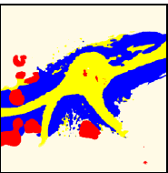

## BEVNet vs Ours

```{=html}
<div class="results-grid">
  <div class="panel left-panel">
    <div class="panel-title">Qualitative comparison</div>

    <div class="toolbar">
      <span class="toolbar-label">View:</span>
      <button class="view-btn active" data-view="compare">Compare</button>
      <button class="view-btn" data-view="bevnet">BEVNet</button>
      <button class="view-btn" data-view="ours">Ours</button>
      <button class="view-btn" data-view="gt">Ground truth</button>
      <button class="view-btn" data-view="camera">Camera</button>
      <button class="view-btn" data-view="scan">Input scan</button>
    </div>

    <div class="slider-row" id="compareRow">
      <label for="blendRange">Wipe</label>
      <input id="blendRange" type="range" min="0" max="100" value="50" />
      <span id="blendLabel">50%</span>
    </div>

    <div class="compare-stage" id="compareStage">
      
      <div class="overlay-wrap" id="overlayWrap">
        
      </div>
      <div class="compare-line" id="compareLine"></div>
      <div class="compare-tag tag-left">BEVNet</div>
      <div class="compare-tag tag-right">Ours</div>
    </div>

    <div class="single-stage hidden" id="singleStage">
      
      <div class="single-caption" id="singleCaption">Ours</div>
    </div>
  </div>

  <div class="panel right-panel">
    <div class="panel-title">Confusion matrix</div>
    <div class="matrix-wrap">
      <div class="axis-label axis-top">Predicted</div>
      <div class="axis-label axis-left">True</div>
      <div class="tick-row" id="tickTop"></div>
      <div class="tick-col" id="tickLeft"></div>
      <div class="matrix" id="matrix"></div>
    </div>

    <div class="info-card" id="cellInfo">
      <div class="info-title">Hover a cell</div>
      <div class="info-body">See exact confusion values and what they mean.</div>
    </div>
  </div>
</div>
```

```{=html}
<style>
.reveal .slides section { font-size: 0.72em; }
.reveal h2 { margin-bottom: 0.25em; }
.results-grid {
  display: grid;
  grid-template-columns: 1.15fr 0.85fr;
  gap: 18px;
  align-items: start;
}
.panel {
  background: #fff;
  border: 1px solid #d9dde6;
  border-radius: 14px;
  padding: 14px;
  box-shadow: 0 8px 20px rgba(0,0,0,0.06);
}
.panel-title {
  font-weight: 700;
  font-size: 1em;
  margin-bottom: 10px;
}
.toolbar {
  display: flex;
  flex-wrap: wrap;
  gap: 7px;
  align-items: center;
  margin-bottom: 10px;
}
.toolbar-label { color: #475467; font-size: 0.85em; }
.view-btn {
  border: 1px solid #cfd6e6;
  background: #f5f7fb;
  border-radius: 999px;
  padding: 5px 10px;
  font-size: 0.78em;
  cursor: pointer;
}
.view-btn.active { background: #1f5aa6; color: #fff; border-color: #1f5aa6; }
.slider-row {
  display: flex;
  align-items: center;
  gap: 8px;
  margin-bottom: 10px;
  font-size: 0.82em;
}
.slider-row input[type="range"] { width: 180px; }
#blendLabel { min-width: 36px; font-weight: 700; }
.compare-stage, .single-stage {
  position: relative;
  width: 100%;
  aspect-ratio: 525 / 190;
  border-radius: 12px;
  overflow: hidden;
  border: 1px solid #d4d8e3;
  background: #e9e5d3;
}
.compare-stage img, .single-stage img {
  position: absolute;
  inset: 0;
  width: 100%;
  height: 100%;
  object-fit: contain;
  background: #e9e5d3;
}
.overlay-wrap {
  position: absolute;
  inset: 0;
  width: 50%;
  overflow: hidden;
}
.overlay-wrap img {
  width: 100%;
  height: 100%;
  object-fit: contain;
  background: #e9e5d3;
}
.compare-line {
  position: absolute;
  top: 0;
  bottom: 0;
  left: 50%;
  width: 3px;
  background: rgba(255,255,255,0.95);
  box-shadow: 0 0 0 1px rgba(0,0,0,0.15);
}
.compare-tag, .single-caption {
  position: absolute;
  top: 8px;
  padding: 4px 10px;
  border-radius: 999px;
  font-size: 0.72em;
  font-weight: 700;
  background: rgba(255,255,255,0.92);
}
.tag-left { left: 8px; }
.tag-right { right: 8px; }
.single-caption { left: 8px; top: auto; bottom: 8px; }
.hidden { display: none; }
.matrix-wrap {
  position: relative;
  width: 320px;
  margin: 8px auto 12px auto;
  padding-top: 28px;
  padding-left: 28px;
}
.matrix {
  display: grid;
  grid-template-columns: repeat(4, 1fr);
  gap: 6px;
}
.matrix-cell {
  aspect-ratio: 1/1;
  border-radius: 10px;
  display: flex;
  align-items: center;
  justify-content: center;
  font-weight: 700;
  font-size: 0.82em;
  cursor: pointer;
  border: 2px solid transparent;
  transition: transform .12s ease, border-color .12s ease;
}
.matrix-cell:hover, .matrix-cell.active { transform: scale(1.03); border-color: #111827; }
.tick-row, .tick-col {
  position: absolute;
  font-size: 0.72em;
  color: #4b5563;
}
.tick-row {
  top: 0;
  left: 34px;
  right: 0;
  display: grid;
  grid-template-columns: repeat(4, 1fr);
  gap: 6px;
  text-align: center;
}
.tick-col {
  top: 34px;
  left: 0;
  bottom: 0;
  display: grid;
  grid-template-rows: repeat(4, 1fr);
  gap: 6px;
  align-items: center;
  text-align: center;
}
.axis-label {
  position: absolute;
  font-size: 0.74em;
  color: #374151;
  font-weight: 700;
}
.axis-top { top: -18px; left: 50%; transform: translateX(-50%); }
.axis-left { left: -24px; top: 50%; transform: translateY(-50%) rotate(-90deg); }
.info-card {
  border: 1px solid #d6dbe6;
  border-radius: 12px;
  padding: 12px;
  background: #f7f9fc;
  min-height: 88px;
}
.info-title { font-weight: 700; margin-bottom: 6px; }
.info-body { font-size: 0.82em; line-height: 1.35; color: #475467; }
</style>

<script>
const matrixData = [
  [0.72, 0.25, 0.01, 0.000027],
  [0.000031, 0.64, 0.22, 0.031],
  [0.0000022, 0.11, 0.83, 0.038],
  [0.0, 0.025, 0.075, 0.79]
];
const classNames = ["0", "1", "2", "3"];
const imageMap = {
  bevnet: {src: "bevnet.png", caption: "BEVNet"},
  ours: {src: "ours.png", caption: "Ours"},
  gt: {src: "groundtruth.png", caption: "Ground truth"},
  camera: {src: "camera.png", caption: "Camera view"},
  scan: {src: "input.png", caption: "Input scan"}
};
function blueShade(v) {
  const t = Math.max(0, Math.min(1, v));
  const r = Math.round(240 - 60 * t);
  const g = Math.round(245 - 110 * t);
  const b = Math.round(250 - 25 * t);
  return `rgb(${r},${g},${b})`;
}
function textColor(v) { return v > 0.45 ? "#ffffff" : "#1f2937"; }
function fmt(v) {
  if (v === 0) return "0";
  if (v < 0.001) return v.toExponential(1);
  if (v < 0.1) return v.toFixed(3).replace(/0+$/,'').replace(/\.$/,'');
  return v.toFixed(2);
}
function interpretation(r, c, v) {
  if (r === c) return `Strong correct classification for class ${r} (${fmt(v)}).`;
  return `True class ${r} is confused with predicted class ${c} (${fmt(v)}).`;
}
function initInteractiveResults() {
  const matrix = document.getElementById('matrix');
  if (!matrix || matrix.dataset.ready === '1') return;
  matrix.dataset.ready = '1';
  const info = document.getElementById('cellInfo');
  const top = document.getElementById('tickTop');
  const left = document.getElementById('tickLeft');
  classNames.forEach(c => {
    const a = document.createElement('div'); a.textContent = c; top.appendChild(a);
    const b = document.createElement('div'); b.textContent = c; left.appendChild(b);
  });
  matrixData.forEach((row, r) => row.forEach((val, c) => {
    const cell = document.createElement('div');
    cell.className = 'matrix-cell';
    cell.style.background = blueShade(val);
    cell.style.color = textColor(val);
    cell.textContent = fmt(val);
    const updateInfo = () => {
      document.querySelectorAll('.matrix-cell').forEach(el => el.classList.remove('active'));
      cell.classList.add('active');
      info.innerHTML = `<div class="info-title">True ${r} → Predicted ${c}</div><div class="info-body"><strong>Value:</strong> ${fmt(val)}<br>${interpretation(r,c,val)}</div>`;
    };
    cell.addEventListener('mouseenter', updateInfo);
    cell.addEventListener('click', updateInfo);
    matrix.appendChild(cell);
  }));
  const compareRow = document.getElementById('compareRow');
  const compareStage = document.getElementById('compareStage');
  const singleStage = document.getElementById('singleStage');
  const overlayWrap = document.getElementById('overlayWrap');
  const compareLine = document.getElementById('compareLine');
  const blendRange = document.getElementById('blendRange');
  const blendLabel = document.getElementById('blendLabel');
  const singleImg = document.getElementById('singleImg');
  const singleCaption = document.getElementById('singleCaption');
  function updateBlend(v) {
    overlayWrap.style.width = `${v}%`;
    compareLine.style.left = `${v}%`;
    blendLabel.textContent = `${v}%`;
  }
  blendRange.addEventListener('input', e => updateBlend(e.target.value));
  updateBlend(blendRange.value);
  document.querySelectorAll('.view-btn').forEach(btn => {
    btn.addEventListener('click', () => {
      document.querySelectorAll('.view-btn').forEach(b => b.classList.remove('active'));
      btn.classList.add('active');
      const view = btn.dataset.view;
      if (view === 'compare') {
        compareRow.classList.remove('hidden');
        compareStage.classList.remove('hidden');
        singleStage.classList.add('hidden');
      } else {
        compareRow.classList.add('hidden');
        compareStage.classList.add('hidden');
        singleStage.classList.remove('hidden');
        singleImg.src = imageMap[view].src;
        singleCaption.textContent = imageMap[view].caption;
      }
    });
  });
}
document.addEventListener('DOMContentLoaded', initInteractiveResults);
if (window.Reveal) {
  Reveal.on('ready', initInteractiveResults);
  Reveal.on('slidechanged', initInteractiveResults);
}
</script>
```
